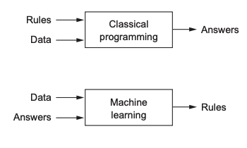
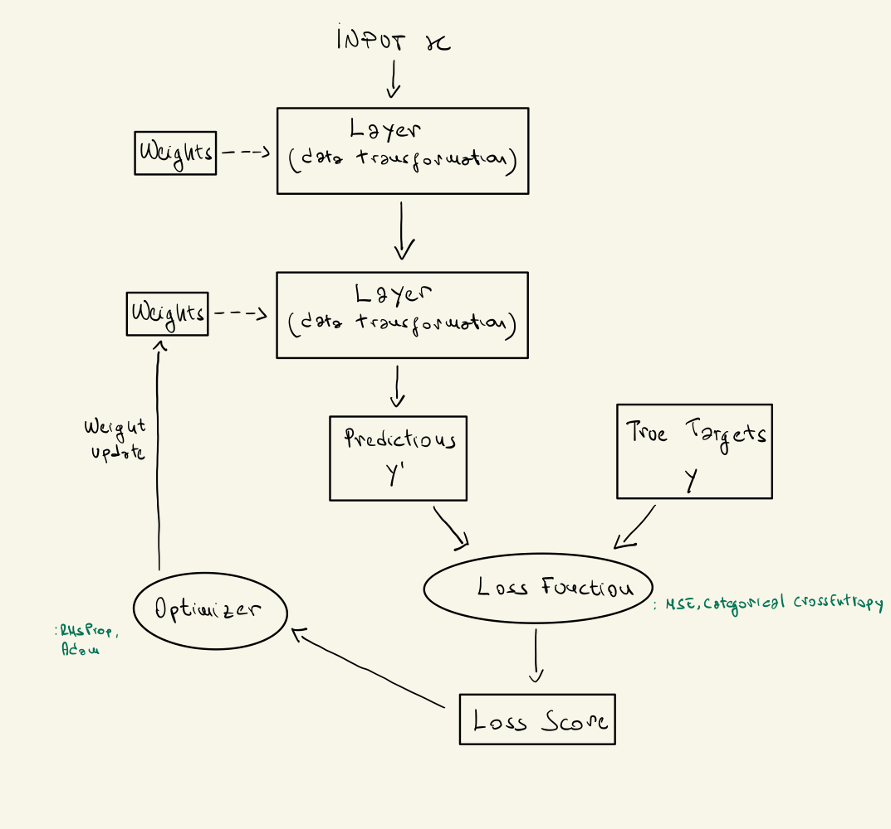
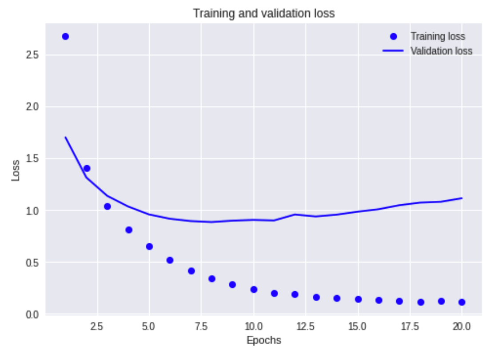
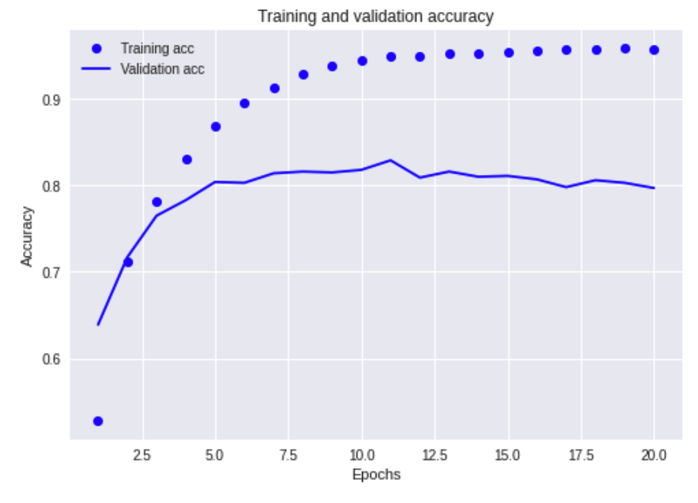

- [Intro](#intro)
- [Deep learning vs Other ML approaches](#deep-learning-vs-other-ml-approaches)
  * [Deep learning](#deep-learning)
    + [Differences with shallow learning approaches](#differences-with-shallow-learning-approaches)
- [Deep learning building blocks](#deep-learning-building-blocks)
  * [Neural network anatomy](#neural-network-anatomy)
  * [Layers](#layers)
  * [Models](#models)
  * [Loss functions and optimizers](#loss-functions-and-optimizers)
  * [Putting all together](#putting-all-together)
- [Deep Learning - Reference Framework](#deep-learning---reference-framework)
  * [1. Problem definition and dataset](#1-problem-definition-and-dataset)
  * [2. Measuring success](#2-measuring-success)
  * [3. Stategy to evaluate your model](#3-stategy-to-evaluate-your-model)
  * [4. Data preparation](#4-data-preparation)
  * [5. Model architecture](#5-model-architecture)
  * [6. Developing a model that overfits](#6-developing-a-model-that-overfits)
  * [7. Regularization](#7-regularization)

# Intro

This document aims to summarise deep-learning important aspects collected during studying hours and practical examples

**Machine Learning vs Classical Programming**

# Deep learning vs Other ML approaches

A machine-learning model transforms its input data into meaningful outputs, a process that is “learned” from exposure to known examples of inputs and outputs. Therefore, the central problem in machine learning and deep learning is to meaningfully transform data: in other words, to learn useful representations of the input data at hand—representations that get us closer to the expected output

All machine-learning algorithms consist of automatically finding such transformations that turn data into more-useful representations for a given task. These operations can be coordinate changes or linear projections (which may destroy information), translations, nonlinear operations (such as “select all pointssuch that x > 0”), and so on. 
Machine-learning algorithms aren’t usually creative in finding these transformations; they’re merely searching through a predefined set of operations, called a hypothesis space.
So that’s what machine learning is, technically: searching for useful representations of some input data, within a predefined space of possibilities, using guidance from a feedback signal. This simple idea allows for solving a remarkably broad range of intellectual tasks, from speech recognition to autonomous car driving.

## Deep learning 

Deep learning is a specific subfield of machine learning: a new take on learning representations from data that puts an emphasis on learning successive layers of increasingly
meaningful representations. The *deep* in deep learning isn’t a reference to any kind of deeper understanding achieved by the approach; rather, it stands for this idea of successive layers of representations. How many layers contribute to a model of the data is called the depth of the model. 

In deep learning, these layered representations are (almost always) learned via models called **neural networks**, structured in literal layers stacked on top of each other.

### Differences with shallow learning approaches

The primary reason deep learning took off so quickly is that it offered better performance on many problems. But that’s not the only reason. Deep learning also makes problem-solving much easier, because it completely automates what used to be the most crucial step in a machine-learning workflow: feature engineering. Previous machine-learning techniques—shallow learning—only involved transforming the input data into one or two successive representation spaces, usually via simple transformations such as high-dimensional non-linear projections (SVMs) or decision trees. But the refined representations required by complex problems generally can’t be attained by such techniques. As such, humans had to go to great lengths to make the initial input data more amenable to processing by these methods: they
had to manually engineer good layers of representations for their data. This is called feature engineering. Deep learning, on the other hand, completely automates this step: with deep learning, you learn all features in one pass rather than having to engineer them yourself. This has greatly simplified machine-learning workflows, often replacing sophisticated multistage pipelines with a single, simple, end-to-end deep-learning model.

These are the two essential characteristics of how deep learning learns from data:the incremental, layer-by-layer way in which increasingly complex representations are developed,and the fact that these intermediate incremental representations are learned jointly, each layer being updated to follow both the representational needs of the layer above and the needs of the layer below. Together, these two properties have made deep learning vastly more successful than previous approaches to machine learning.

# Deep learning building blocks

- Learning means finding a combination of model parameters that minimizes a loss function for a given set of training data samples and their corresponding targets.
- Learning happens by drawing random batches of data samples and their targets, and computing the gradient of the network parameters with respect to the loss on the batch. The network parameters are then moved a bit (the magnitude of the move is defined by the learning rate) in the opposite direction from the gradient.
- The entire learning process is made possible by the fact that neural networks are chains of differentiable tensor operations, and thus it’s possible to apply the chain rule of derivation to find the gradient function mapping the current parameters and current batch of data to a gradient value.
- Loss functions and optimizers: these are the two things you need to define before you begin feeding data into a network.
- The loss is the quantity you’ll attempt to minimize during training, so it should represent a measure of success for the task you’re trying to solve. Typical examples are: categorical crossentropy, binary crossentropy, mean squared error, etc. For a full list: https://keras.io/api/losses/.
- The optimizer specifies the exact way in which the gradient of the loss will be used to update parameters: for instance, it could be the RMSProp optimizer, SGD with momentum, and so on.
- Along with loss and optimizer, we usually define a metric that we want to monitor during the training and validation process. Typical examples are: accuracy, mean absolute error, auc, etc. For a full list: 
https://keras.io/api/metrics/.

## Neural network anatomy

Training a neural network revolves around the following objects:

- Layers, which are combined into a network (or model)
- The input data and corresponding targets
- The loss function, which defines the feedback signal used for learning
- The optimizer, which determines how learning proceeds

## Layers

A layer is a data-processing module that takes as input one or more tensors and that outputs one or more tensors. Some layers are stateless, but more frequently layers have a state: the layer’s weights, one or several tensors learned with stochastic gradient descent, which together contain the network’s knowledge.
Different layers are appropriate for different tensor formats and different types of data processing. For instance, simple vector data, stored in 2D tensors of shape (samples, features), is often processed by densely connected layers, also called fully connected or dense layers (the Dense class in Keras). Sequence data, stored in 3D tensors of shape (samples, timesteps, features), is typically processed by recurrent layers such as an LSTM layer. Image data, stored in 4D tensors, is usually processed by 2D convolution layers (Conv2D).

You can think of layers as the LEGO bricks of deep learning, a metaphor that is made explicit by frameworks like Keras. Building deep-learning models in Keras is done by clipping together compatible layers to form useful data-transformation pipelines.

## Models

A deep-learning model is a directed, acyclic graph of layers. The most common instance is a linear stack of layers, mapping a single input to a single output. But as you move forward, you’ll be exposed to a much broader variety of network topologies. Some common ones include the following: Two-branch networks, Multihead networks, Inception blocks.

The topology of a network defines a hypothesis space. We defined machine learning as “searching for useful representations of some input data, within a predefined space of possibilities, using guidance from a feedback signal.” By choosing a network topology, you constrain your space of possibilities (hypothesis space) to a specific series of tensor operations, mapping input data to output data. What you’ll then be searching for is a good set of values for the weight tensors involved in these tensor operations.

## Loss functions and optimizers

Once the network architecture is defined, you still have to choose two more things:
- Loss function (objective function)—The quantity that will be minimized during training. It represents a measure of success for the task at hand.
- Optimizer—Determines how the network will be updated based on the loss function. It implements a specific variant of stochastic gradient descent (SGD).

A neural network that has multiple outputs may have multiple loss functions (one per output). But the gradient-descent process must be based on a single scalar loss value; so, for multiloss networks, all losses are combined (via averaging) into a single scalar quantity.

For instance, you’ll use binary crossentropy for a two-class classification problem, categorical crossentropy for a many-class classification problem, meansquared error for a regression problem, connectionist temporal classification (CTC) for a sequence-learning problem, and so on.

## Putting all together

If we put all of the above together, we can summarise using this diagram:

# Deep Learning - Reference Framework

The goal of this paragraph is to define a generalised framework to leverage when approaching a machine learning problem. There are going to be references specific to deep learning, but all the elements of the framework can be applied to other statistical learning methods.

## 1. Problem definition and dataset

1. What will your input data be? What are you trying to predict? You can only learn to predict something if you have available training data: for example, you can
only learn to classify the sentiment of movie reviews if you have both movie reviews and sentiment annotations available. Data availability is usually the limiting factor at this stage 
2. What type of problem are you facing? Is it binary classification? Multiclass classification? Scalar regression? Vector regression? Multiclass, multilabel classification? Something else, like clustering, generation, or reinforcement learning? Identifying the problem type will guide your choice of model architecture, loss function, and so on.

You can’t move to the next stage until you know what your inputs and outputs are, and what data you’ll use. Be aware of the hypotheses you make at this stage:
 - You hypothesize that your outputs can be predicted given your inputs
 - You hypothesize that your available data is sufficiently informative to learn the relationship between inputs and outputs

Until you have a working model, these are merely hypotheses, waiting to be validated or invalidated. Not all problems can be solved; just because you’ve assembled examples of inputs X and targets Y doesn’t mean X contains enough information to predict Y.

<i>Non-stationary problems note</i>

One class of unsolvable problems you should be aware of is *nonstationary problems*. Suppose you’re trying to build a recommendation engine for clothing, you’re training
it on one month of data (August), and you want to start generating recommendations in the winter. One big issue is that the kinds of clothes people buy change from season
to season: clothes buying is a nonstationary phenomenon over the scale of a few months. What you’re trying to model changes over time. In this case, the right move is
to constantly retrain your model on data from the recent past, or gather data at a timescale where the problem is stationary. For a cyclical problem like clothes buying, a
few years’ worth of data will suffice to capture seasonal variation—but remember to make the time of the year an input of your model.

Keep in mind that machine learning can only be used to memorize patterns that are present in your training data. You can only recognize what you’ve seen before. Using machine learning trained on past data to predict the future is making the assumption that the future will behave like the past. That often isn’t the case.

## 2. Measuring success 

To control something, you need to be able to observe it. To achieve success, you must define what you mean by success. accuracy? Precision and recall? Customer-retention rate? Your metric for success will guide the choice of a loss function: what your model will optimize. It should directly align with your higher-level goals, such as the success of your business.

For balanced-classification problems, where every class is equally likely, accuracy and area under the receiver operating characteristic curve (ROC AUC) are common metrics. For
class-imbalanced problems, you can use precision and recall. For ranking problems or multilabel classification, you can use mean average precision.

At this stage, your goal is to narrow down: 

- The metric you want to measure: accuracy, ROC AUC, MAE, etc.
- The loss function you want to optimise: binary cross entropy, MSE, etc.

## 3. Stategy to evaluate your model

Once you know what you’re aiming for, you must establish how you’ll measure your current progress. Three common approaches are:

1. Maintaining a hold-out validation set: the way to go when you have plenty ofdata
2. Doing K-fold cross-validation: the right choice when you have too few samplesfor hold-out validation to be reliable
3. Doing iterated K-fold validation: for performing highly accurate model evaluation when little data is available

Just pick one of these. 

## 4. Data preparation

Once you know what you’re training on, what you’re optimizing for, and how to evaluate your approach, you’re almost ready to begin training models. But first, you should format your data in a way that can be fed into a machine-learning model.

For Neural Networks:

 - Your data should be formatted as tensors.
 - The values taken by these tensors should usually be scaled to small values: for example, in the [-1, 1] range or [0, 1] range.
 - If different features take values in different ranges (heterogeneous data), then the data should be normalized.
- You may want to do some feature engineering, especially for small-data problems.

## 5. Developing a model that does better than a baseline

Your goal at this stage is to achieve statistical power: that is, to develop a small model that is capable of beating a dumb baseline. 

<i>Note on statistical power</i>

It’s not always possible to achieve statistical power. If you can’t beat a random baseline after trying multiple reasonable architectures, it may be that the answer
to the question you’re asking isn’t present in the input data. Remember that you make two hypotheses:

- You hypothesize that your outputs can be predicted given your inputs.
- You hypothesize that the available data is sufficiently informative to learn the relationship between inputs and outputs.

It may well be that these hypotheses are false, in which case you must go back to the drawing board.

To build a working model, you need to choose:

1. *Last-layer activation*: this establishes useful constraints on the network’s output. For a classification problem you should use sigmoid (it contraints output between 0 and 1); for a regression one you don't need a last-layer artivation, a softmax (it ouputs the probability distribution over N output classes) etc. 
2. *Loss function*: this should match the type of problem you’re trying to solve. For
a binary classification problem you could use **binary_crossentropy**, a regression one you could use **mse**, and so on.
3. *Optimization configuration*: what optimizer will you use? What will its learning rate be? 
4. *Metric*: which metric you want to monitor? ROC AUC, accuracy, MAE, etc.

Regarding the choice of a loss function, note that it isn’t always possible to directly optimize for the metric that measures success on a problem. Sometimes there is no easy way to turn a metric into a loss function; loss functions, after all, need to be computable given only a mini-batch of data (ideally, a loss function should be computable for as little as a single data point) and must be differentiable (otherwise, you can’t use backpropagation to train your network). 

For instance, the widely used classification metric ROC AUC can’t be directly optimized. Hence, in classification tasks, it’s common to optimize for a proxy metric of ROC AUC, such as crossentropy. In general, you can hope that the lower the crossentropy gets, the higher the ROC AUC will be.

## 6. Developing a model that overfits

Once you’ve obtained a model that has statistical power, the question becomes, is your model sufficiently powerful? Does it have enough layers and parameters to properly
model the problem at hand? **Remember that the universal tension in machine learning is between optimization and generalization**; the ideal model is one that stands right at the border
between underfitting and overfitting; between undercapacity and overcapacity. To figure out where this border lies, first you must cross it. To figure out how big a model you’ll need, you must develop a model that overfits.

This is fairly easy:

1. Add layers.
2. Make the layers bigger.
3. Train for more epochs.

Always monitor the training loss and validation loss, as well as the training and validation values for any metrics you care about. When you see that the model’s performance on the validation data begins to degrade, you’ve achieved overfitting.

At this stage, you are tuning your **hyperparameters** (that differ from the **parameters** of the model you have chosen upon, the weights are the parameters of the model). So **hyperparameters tuning** is done using the validation set. The next stage is to start regularizing and tuning the model (also here you will leverage hyperparameters), to get as close as possible to the ideal model that neither underfits nor overfits. 

In general, at this stage you are looking to reduce the bias of you model by working on the cost function that you aim to optimize. This leads to low bias, but maybe high variance and you'll tackle that in the next step.

## 7. Regularization

This step will take the most time: you’ll repeatedly modify your model, train it, evaluate on your validation data, modify it again, and repeat, until the model is as good as it can get. 

For NN, these are some things you should try to get a model that perform better on the validation set:

 - Add dropout.
 - Try different architectures: add or remove layers.
 - Add L1 and/or L2 regularization.
 - Early stopping.
 - Try different hyperparameters (such as the number of units per layer or the learning rate of the optimizer) to find the optimal configuration.
 - Optionally, iterate on feature engineering: add new features, or remove features that don’t seem to be informative.

<i>L2 and dropout</i>

In general, the idea behind dropout and L2 is to simplifying the network architecture. Either by removing units within layers (dropout) or having smaller values for the weight in each units (L2).

*Be mindful of the following: every time you use feedback from your validation process to tune your model, you leak information about the validation process into the model.*

Repeated just a few times, this is innocuous; but done systematically over many iterations, it will eventually cause your model to overfit to the validation process (even though no model is directly trained on any of the validation data). This makes the evaluation process less reliable.

Once you’ve developed a satisfactory model configuration, you can train your final production model on all the available data (training and validation) and evaluate it one last time on the test set. If it turns out that performance on the test set is significantly worse than the performance measured on the validation data, this may mean either that your validation procedure wasn’t reliable after all, or that you began overfitting to the validation data while tuning the parameters of the model. In this case, you may want to switch to a more reliable evaluation protocol (such as iterated K-fold validation). 

