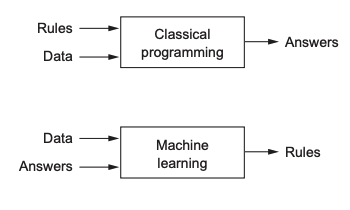

- [Intro](#intro)
- [Deep learning vs Other ML approaches](#deep-learning-vs-other-ml-approaches)
- [Deep learning building blocks](#deep-learning-building-blocks)
  * [Neural network anatomy](#neural-network-anatomy)
  * [Layers](#layers)
  * [Models](#models)
  * [Loss functions and optimizers](#loss-functions-and-optimizers)

# Intro

This document aims to summarise deep-learning important aspects collected during studying hours and practical examples

**Machine Learning vs Classical Programming**

# Deep learning vs Other ML approaches

A machine-learning model transforms its input data into meaningful outputs, a process that is “learned” from exposure to known examples of inputs and outputs. Therefore, the central problem in machine learning and deep learning is to meaningfully transform data: in other words, to learn useful representations of the input data at hand—representations that get us closer to the expected output

All machine-learning algorithms consist of automatically finding such transformations that turn data into more-useful representations for a given task. These operations can be coordinate changes or linear projections (which may destroy information), translations, nonlinear operations (such as “select all pointssuch that x > 0”), and so on. 
Machine-learning algorithms aren’t usually creative in finding these transformations; they’re merely searching through a predefined set of operations, called a hypothesis space.
So that’s what machine learning is, technically: searching for useful representations of some input data, within a predefined space of possibilities, using guidance from a feedback signal. This simple idea allows for solving a remarkably broad range of intellectual tasks, from speech recognition to autonomous car driving-

*Deep learning* is a specific subfield of machine learning: a new take on learning representations from data that puts an emphasis on learning successive layers of increasingly
meaningful representations. The deep in deep learning isn’t a reference to any kind of deeper understanding achieved by the approach; rather, it stands for this idea of successive layers of representations. How many layers contribute to a model of the data is called the depth of the model. 

In deep learning, these layered representations are (almost always) learned via models called neural networks, structured in literal layers stacked on top of each other.

The primary reason deep learning took off so quickly is that it offered better performance on many problems. But that’s not the only reason. Deep learning also makes problem-solving much easier, because it completely automates what used to be the most crucial step in a machine-learning workflow: feature engineering. Previous machine-learning techniques—shallow learning—only involved transforming the input data into one or two successive representation spaces, usually via simple transformations such as high-dimensional non-linear projections (SVMs) or decision trees. But the refined representations required by complex problems generally can’t be attained by such techniques. As such, humans had to go to great lengths to make the initial input data more amenable to processing by these methods: they
had to manually engineer good layers of representations for their data. This is called feature engineering. Deep learning, on the other hand, completely automates this step: with deep learning, you learn all features in one pass rather than having to engineer them yourself. This has greatly simplified machine-learning workflows, often replacing sophisticated multistage pipelines with a single, simple, end-to-end deep-learning model.

These are the two essential characteristics of how deep learning learns from data:the incremental, layer-by-layer way in which increasingly complex representations are developed,and the fact that these intermediate incremental representations are learned jointly, each layer being updated to follow both the representational needs of the layer above and the needs of the layer below. Together, these two properties have made deep learning vastly more successful than previous approaches to machine learning.

# Deep learning building blocks

- Learning means finding a combination of model parameters that minimizes a loss function for a given set of training data samples and their corresponding targets.
- Learning happens by drawing random batches of data samples and their targets, and computing the gradient of the network parameters with respect to the loss on the batch. The network parameters are then moved a bit (the magnitude of the move is defined by the learning rate) in the opposite direction from the gradient.
- The entire learning process is made possible by the fact that neural networks are chains of differentiable tensor operations, and thus it’s possible to apply the chain rule of derivation to find the gradient function mapping the current parameters and current batch of data to a gradient value.
- Loss functions and optimizers: these are the two things you need to define before you begin feeding data into a network.
- The loss is the quantity you’ll attempt to minimize during training, so it should represent a measure of success for the task you’re trying to solve.
- The optimizer specifies the exact way in which the gradient of the loss will be used to update parameters: for instance, it could be the RMSProp optimizer, SGD with momentum, and so on.

## Neural network anatomy

Training a neural network revolves around the following objects:

- Layers, which are combined into a network (or model)
- The input data and corresponding targets
- The loss function, which defines the feedback signal used for learning
- The optimizer, which determines how learning proceeds

## Layers

A layer is a data-processing module that takes as input one or more tensors and that outputs one or more tensors. Some layers are stateless, but more frequently layers have a state: the layer’s weights, one or several tensors learned with stochastic gradient descent, which together contain the network’s knowledge.
Different layers are appropriate for different tensor formats and different types of data processing. For instance, simple vector data, stored in 2D tensors of shape (samples, features), is often processed by densely connected layers, also called fully connected or dense layers (the Dense class in Keras). Sequence data, stored in 3D tensors of shape (samples, timesteps, features), is typically processed by recurrent layers such as an LSTM layer. Image data, stored in 4D tensors, is usually processed by 2D convolution layers (Conv2D).

You can think of layers as the LEGO bricks of deep learning, a metaphor that is made explicit by frameworks like Keras. Building deep-learning models in Keras is done by clipping together compatible layers to form useful data-transformation pipelines.

## Models

A deep-learning model is a directed, acyclic graph of layers. The most common instance is a linear stack of layers, mapping a single input to a single output. But as you move forward, you’ll be exposed to a much broader variety of network topologies. Some common ones include the following: Two-branch networks, Multihead networks, Inception blocks.

The topology of a network defines a hypothesis space. We defined machine learning as “searching for useful representations of some input data, within a predefined space of possibilities, using guidance from a feedback signal.” By choosing a network topology, you constrain your space of possibilities (hypothesis space) to a specific series of tensor operations, mapping input data to output data. What you’ll then be searching for is a good set of values for the weight tensors involved in these tensor operations.

## Loss functions and optimizers

Once the network architecture is defined, you still have to choose two more things:
- Loss function (objective function)—The quantity that will be minimized during training. It represents a measure of success for the task at hand.
- Optimizer—Determines how the network will be updated based on the loss function. It implements a specific variant of stochastic gradient descent (SGD).

A neural network that has multiple outputs may have multiple loss functions (one per output). But the gradient-descent process must be based on a single scalar loss value; so, for multiloss networks, all losses are combined (via averaging) into a single scalar quantity.

For instance, you’ll use binary crossentropy for a two-class classification problem, categorical crossentropy for a many-class classification problem, meansquared error for a regression problem, connectionist temporal classification (CTC) for a sequence-learning problem, and so on.

